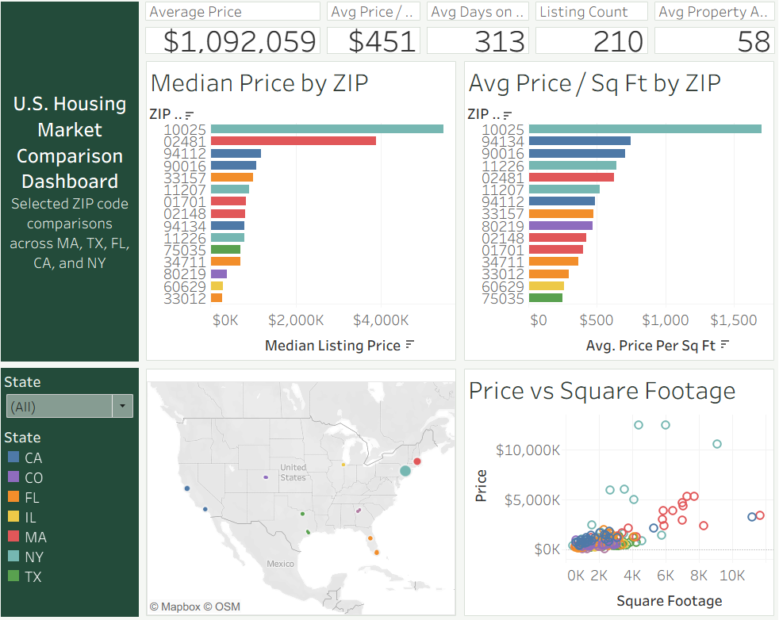

# U.S. Housing Market Comparison Dashboard

This project analyzes residential sale listings across selected ZIP codes in multiple U.S. states using Python, SQL Server, and Tableau. It includes an end-to-end workflow for data extraction, cleaning, storage, and dashboarding, with comparisons of price, price per square foot, days on market, and geographic distribution.

## Live Dashboard

[View the interactive Tableau dashboard here]https://public.tableau.com/app/profile/tulio.machado.pinheiro/vizzes

## Dashboard Preview



## Dashboard Overview

The dashboard compares selected ZIP codes across multiple states and includes:

- KPI cards for average price, price per square foot, days on market, listing count, and property age
- Median price by ZIP
- Average price per square foot by ZIP
- Interactive listing map
- Scatter plot of price vs square footage
- State filter and dashboard actions

## Tech Stack

- Python
- VS Code
- SQL Server
- Tableau
- RentCast API
- GitHub

## Data Pipeline

1. Extract listing data from the RentCast API
2. Save raw JSON files
3. Combine raw listing data into CSV
4. Clean and standardize the dataset
5. Load cleaned data into SQL Server
6. Create SQL views for dashboard use
7. Build an interactive Tableau dashboard

## Project Structure

```text
housing-market-project/
├── src/
├── sql/
├── notebooks/
├── requirements.txt
└── .gitignore
